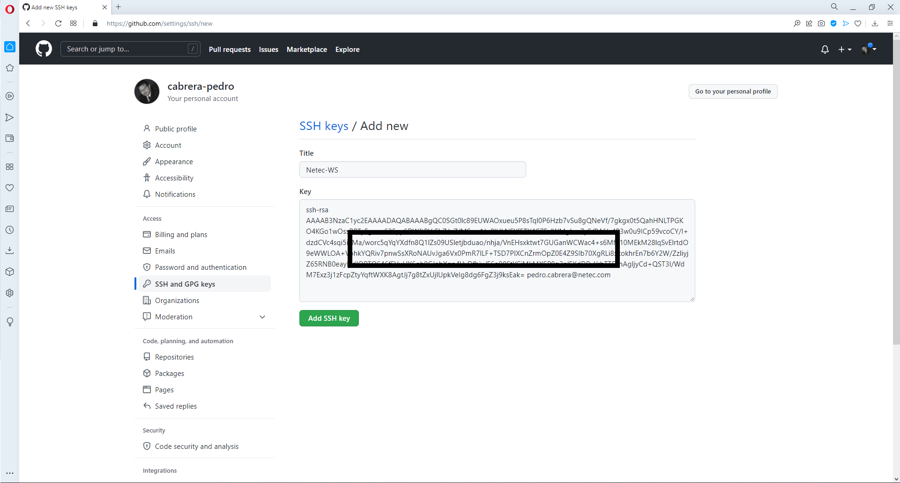
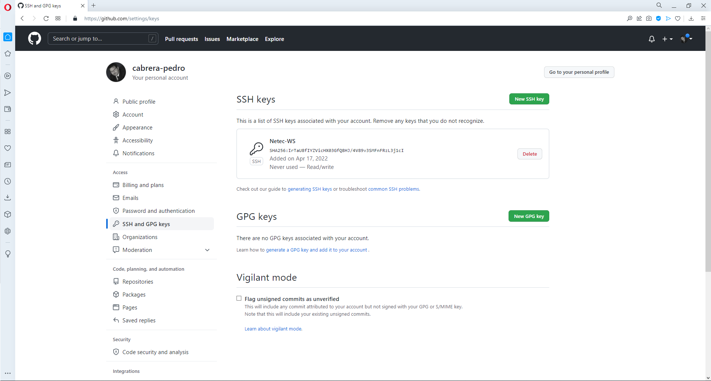

# GITHUB: LLAVES SSH

Tiempo aproximado: 5 minutos

## OBJETIVO

Crear y configurar llaves de acceso a GitHub.

## DESARROLLO

### CREACIÓN Y CONFIGURACIÓN DE LLAVES SSH

Configuración de las llaves para la interacción de la instalación local de *Git* con *GitHub*.

Para interactuar de manera segura desde el Git instalado en tu equipo local y el servidor *GitHub*, se debe crear una llave pública y una privada en el equipo local y registrar la llave pública en la cuenta del usuario en *GitHub*.

#### CREACIÓN DE LLAVES

Primero verifica que no existen llaves, ya que de existir pueden ser utilizadas. Para ello explore el directorio `~/.ssh`. De no encontrar dos archivos con el nombre `id_rsa` y `id_rsa.pub` proceda a su creación.

Ejecute el siguiente comando:

``` shell
#ssh-keygen -t rsa -C "pedro.cabrera@netec.com"
ssh-keygen -t ed25519 -C "pedro.cabrera@netec.com"
```

Contesta presionando la tecla `Enter` a las siguientes tres solicitudes de información.

A continuación, se muestra una ejecución del comando:

``` shell
Generating public/private ed25519 key pair.
Enter file in which to save the key (/home/netec/.ssh/id_ed25519):
Enter passphrase (empty for no passphrase):
Enter same passphrase again:
Your identification has been saved in /home/netec/.ssh/id_ed25519
Your public key has been saved in /home/netec/.ssh/id_ed25519.pub
The key fingerprint is:
SHA256:NshhPwB/DBBp5rXobgETD76ba6Agiz2n7gAQ7x8d8Fg pedro.cabrera@netec.com
The keys randomart image is:
+-- ED25519 256 --
|.   =+E          |
| oo +B.o         |
|...B.oB.o        |
|..+ ++.B         |
|. .=. + S        |
|= ..o. . o       |
|*+ +..           |
|+.* +            |
| +=*             |
+---- SHA256 -----+
```

#### CONFIGURACIÓN EN GITHUB

Para configurar la llave pública en la cuenta de *GitHub* y así poder comunicarse de manera segura escribe el siguiente enlace en un navegador web (debemos haber ingresado previamente con nuestra cuenta)

- <https://github.com/settings/keys>


- Da clic en el botón `New SSH key`.

Llena el formulario con la siguiente información:

- `Title`:
  - NOMBRE_DESCRIPTIVO_PARA_LA_LLAVE
- `Key type`
  - `Authentication Key`
- `Key`:
  - Pega el contenido del archivo `/home/netec/.ssh/id_ed25519.pub`
- Recuerda que esta es una de las llaves previamente generadas
  - De clic en el botón `Add SSH Key`



Puedes validar la adición de su llave al consultar nuevamente el enlace: <https://github.com/settings/keys>



##### VALIDACIÓN

Para validar que la llave adicionada a *GitHub* permite la autenticación del equipo local con el servidor *GitHub* realiza los siguientes pasos en una terminal de comandos:

``` shell
ssh -T git@github.com
# Attempts to ssh to GitHub
```

La salida debe ser similar a:

``` shell
- The authenticity of host github.com (IP ADDRESS) can t be established.
- RSA key fingerprint is SHA256:nThbg6kXUpJWGl7E1IGOCspRomTxdCARLviKw6E5SY8.
- Are you sure you want to continue connecting (yes/no)?
```

Ahora escribe la palabra `yes` y de clic en la tecla `Enter`.

Lo anterior genera una salida semejante a:

``` shell
- Hi username! You have successfully authenticated, but GitHub does not
- provide shell access.
```

##### LINUX

**Únicamente en caso de encontrar el error siguiente en plataformas *Linux***:

``` shell
...
Agent admitted failure to sign using the key.
debug1: No more authentication methods to try.
Permission denied (publickey).
```

Debes ejecutar los siguientes comandos para cargar la identidad:

``` shell
eval "$(ssh-agent -s)"
```

Con una salida similar a:

``` shell
> Agent pid 59566
```

Ahora ejecuta:

``` shell
ssh-add
> Enter passphrase for /home/you/.ssh/id_rsa: [tippy tap]
> Identity added: /home/you/.ssh/id_rsa (/home/you/.ssh/id_rsa)
```

Ahora se debe realizar nuevamente el paso anterior (VALIDACIÓN).

## RESULTADO

Comenta los puntos más relevantes de esta tarea.

---

[CAPÍTULO 05](../C05.md)
