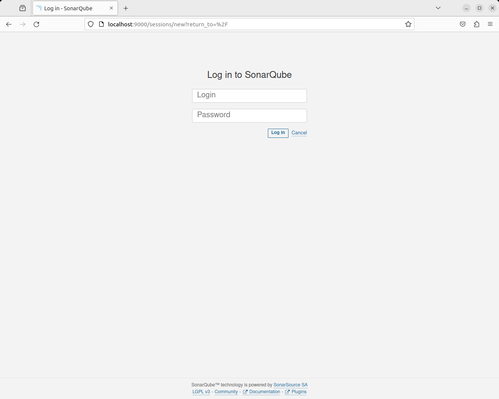
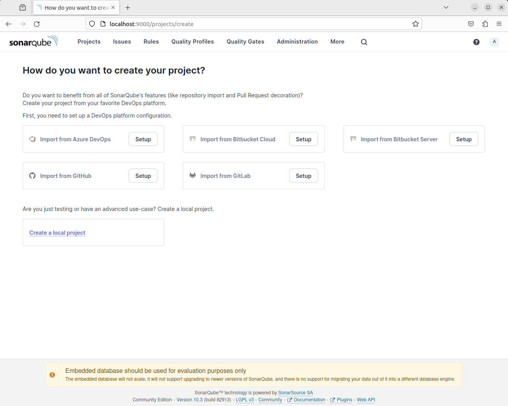
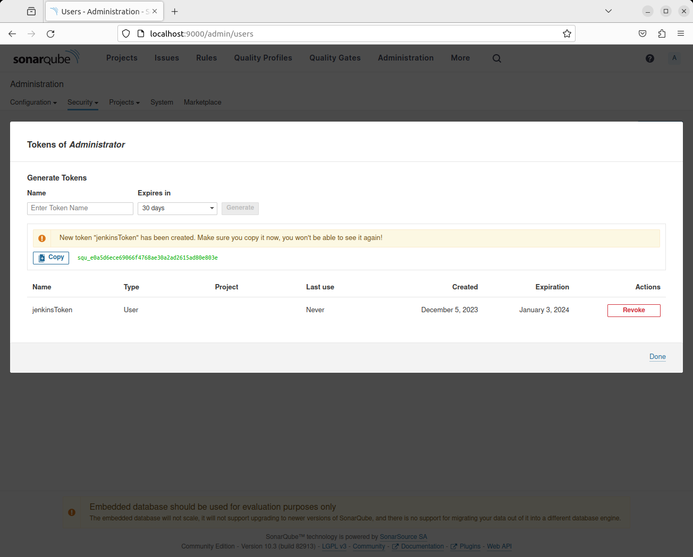

# SONARQUBE: INSTALACIÓN

Tiempo aproximado: 10 minutos

## OBJETIVO

Instalar y configurar la herramienta de análisis de código estático *SonarQube*.

## DESARROLLO

Los procesos de instalación varían de versión a versión y dependen del sistema operativo, por lo que te recomendamos se visite el sitio oficial para los detalles de instalación particulares.

- <https://docs.sonarsource.com/sonarqube/latest/setup-and-upgrade/overview/>

### INSTALACIÓN

#### IMAGEN DOCKER

Para descargar la imagen más reciente de *SonarQube* ejecuta:

``` shell
docker pull sonarqube
```

La salida será similar a:

``` shell
Using default tag: latest
latest: Pulling from library/sonarqube
cbe3537751ce: Already exists
6cd63fc495d1: Already exists
9c42674dea4f: Pull complete
a992519bbaee: Pull complete
506583e9517b: Pull complete
1f5ec129d7c9: Pull complete
55466329b2ef: Pull complete
Digest: sha256:c9fc479ae8aca6393bc0e9852910bfdd14a001bcc37eca652290c1a5ca3b3ae6
Status: Downloaded newer image for sonarqube:latest
docker.io/library/sonarqube:latest
```

#### CONTENEDOR

Para crear el contenedor en el que quedará en operación *SonarQube* ejecuta:

``` shell
docker run --detach --name sonarqube --publish 9000:9000 --publish 9092:9092 sonarqube
```

La salida será similar a:

``` shell
5154ad4303900bd89ab6ee647f3403319e2ee73c3523a25a63936d3a49eb608f
```

#### CONFIGURACIÓN INICIAL

Para ingresar a la interfaz web de *SonarQube* ingresa la siguiente URL a tu navegador:

- [http://localhost:9000](http://localhost:9000/)

<div class="note">

La primera ocasión suele tarda unos minutos en mostrar la página de autenticación.

</div>



El usuario y contraseña predeterminado es `admin`, al ingresarlo solicitará cambiarlo. Utiliza los siguientes:

- Contraseña actual: `admin`
- Nueva contraseña: `Edu-2024`
- Confirmación de contraseña: `Edu-2024`



### CREACIÓN DE TOKEN

En el enlace <http://localhost:9000/admin/users> da clic en la opción de actualizar tokens localizada en la columna `Tokens` del usuario `Administrador`.

En la ventana contextual `Tokens of Administrator` ingresa:

- Name: `jenkinsToken`
- Expiration: `30 days`
- Da clic en el botón `Generate`.

Guarda el token en un lugar seguro ya que no se mostrará nuevamente.

- `squ_e0a5d6ece69066f4768ae30a2ad2615ad80e803e`

Para concluir este paso da clic en el enlace `Done`.



## RESULTADO

Comenta los puntos más relevantes de esta sección.

---

[CAPÍTULO 07](../C07.md)
