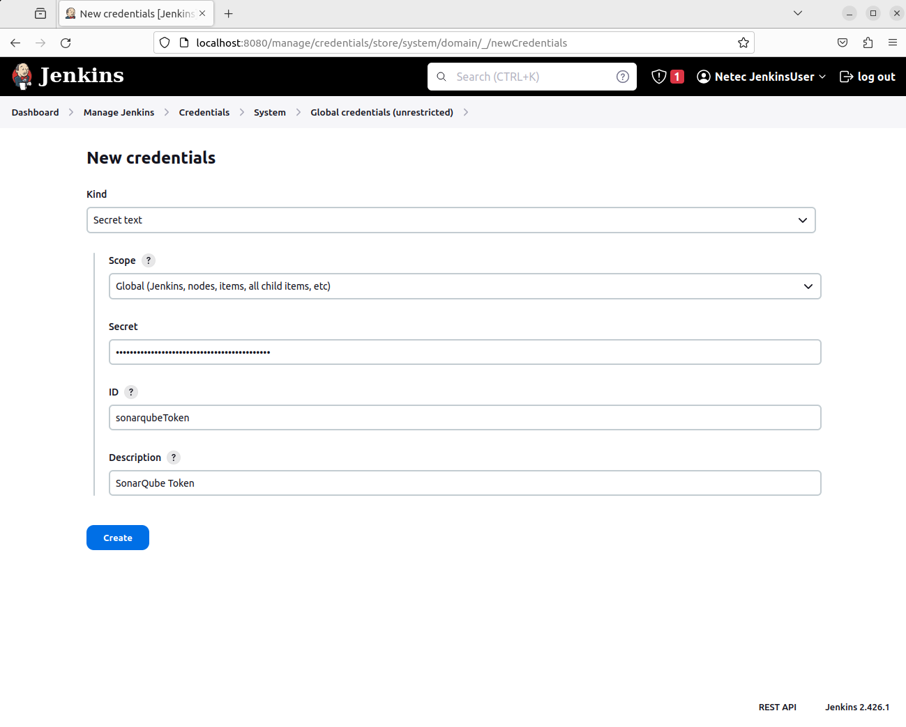
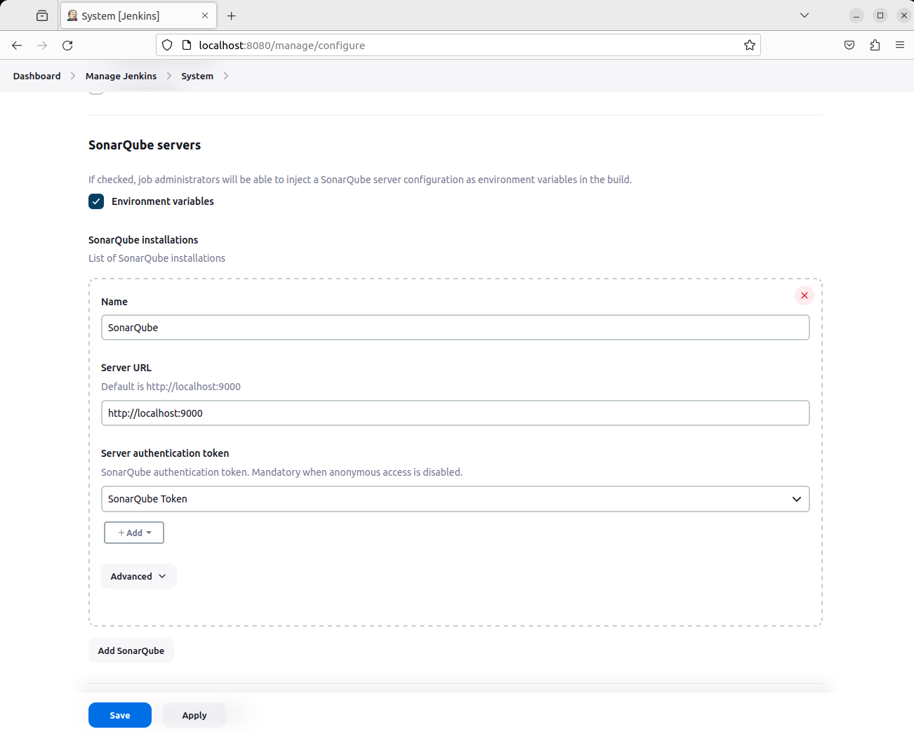

# JENKINS: CONFIGURACIÓN SONARQUBE

Tiempo aproximado: 10 minutos

## OBJETIVO

Configurar *Jenkins* para utilizar las capacidades de análisis de código estático de *SonarQube*.

## PRERREQUISITOS

- *SonarQube* operando.
- Token en *SonarQube*
  - Por ejemplo: `squ_e0a5d6ece69066f4768ae30a2ad2615ad80e803e`

## DESARROLLO

Para la interacción de *Jenkins* con *SonarQube* se requiere un complemento y configurar el token de acceso.

### TOKEN DE ACCESO

Para la comunicación de *Jenkins* y *SonarQube* se debe crear una credencial.

Da clic en el botón `Add Credentials` en la siguiente pantalla en Jenkins: <http://localhost:8080/manage/credentials/store/system/domain/>*/\[<http://localhost:8080/manage/credentials/store/system/domain/>*/\]

- Kind: Secret text
- Secret: `squ_e0a5d6ece69066f4768ae30a2ad2615ad80e803e`
  - PEGAR EL TOKEN DE PASO ANTERIOR.
- ID: `sonarqubeToken`
- Description: `SonarQube Token`
- Clic en el botón `Create`

Ahora puede verse la credencial recién creada.

### COMPLEMENTO

En un navegador web ingresa el enlace <http://localhost:8080/manage/pluginManager/available> para configurar el complemento de *SonarQube* en *Jenkins*.

En el campo de búsqueda ingresa `SonarQube Scanner`, de la lista selecciona el componente localizado. Marca la opción de `Install` y da clic en el botón `Install`.

Marca la opción `Restart Jenkins when installation is complete and no jobs are running` y espera a que el proceso termine la instalación y reinicie _Jenkins_.

### CONFIGURACIÓN: SONARQUBE SERVERS

En la opción `Configure System` de *Jenkins* en el enlace: <http://localhost:8080/manage/configure>, localiza la sección\` SonarQube servers\` e ingresa la información:

- SonarQube servers
  - Environment variables: [SELECCIONADO]
  - Add SonarQube
    - Name: `SonarQube`
    - Server URL: `http://localhost:9000`
    - Server authentication token: `SonarQube Token`

Da clic en `Apply` y `Save`.

### CONFIGURACIÓN HERRAMIENTAS: SONARQUBE SCANNER

En la ventana de configuración de herramientas globales (<http://localhost:8080/manage/configureTools/>) realizar la siguiente configuración:

- SonarQube Scanner installations
  - Name: `SonarScanner`
  - Install automatically: [SELECCIONADO\
    - Install from Maven Central
      - Version: `SonarQube Scanner 5.0.1.3006`

Da clic en `Apply` y `Save`.

## RESULTADO

Comenta los puntos más relevantes de esta sección.

---

[CAPÍTULO 07](../C07.md)
