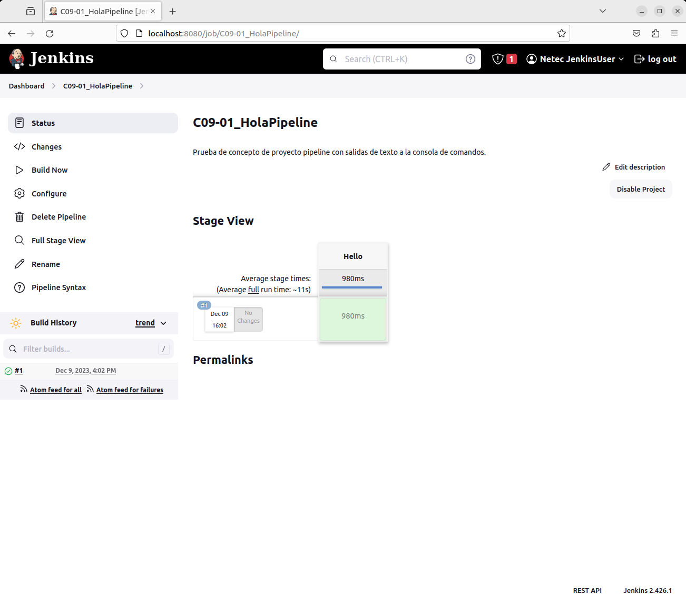
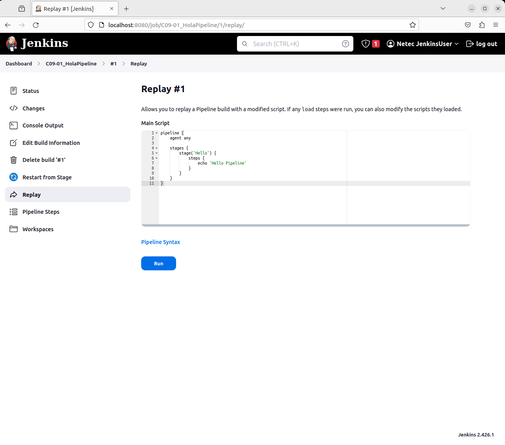

# HOLA PIPELINE

Tiempo aproximado: 10 minutos

## OBJETIVO

Crear un proyecto *pipeline* con un mensaje de texto en la línea de comandos.

## DESARROLLO

### CREACIÓN

En la pantalla principal (<http://localhost:8080/>) de Jenkins crea un nuevo proyecto dando clic en [+ New Item](http://localhost:8080/view/all/newJob) con los siguientes datos:

- Nombre: `C09-01_HolaPipeline`
- Tipo de proyecto: `Pipeline`

Después de ingresar la información da clic en `OK`.

### CONFIGURACIÓN

A continuación, se indica la información a añadir en cada sección.

#### GENERAL

En la sección de `Configuration/General` ingresa la siguiente información:

- Descripción: `Prueba de concepto de proyecto pipeline con salidas de texto a la consola de comandos.`

#### PIPELINE

En la opción `Configuration/Pipeline` ingresa la siguiente información:

- Pipeline
  - Definition: Pipeline script
    - Script:

``` groovy
pipeline {
    agent any

    stages {
        stage('Hello') {
            steps {
                echo 'Hello Pipeline'
            }
        }
    }
}
```


Analiza los cambios en la interfaz de usuario respecto a los proyectos estilo libre.

#### SAVE

Da clic en el botón de guardado ( `Save` )

### CONSTRUCCIÓN

Para comprobar el envío de las notificaciones ejecuta el *job* dando clic en la opción `Build Now` del menú lateral.

Adicionalmente comprueba los cambios en la interfaz del *job* y del *build*.



#### SALIDA EN CONSOLA

En la parte inferior de la barra lateral izquierda, en la sección `Build History` se puede apreciar el historial de ejecución (*build*) del *job*.

Al dar clic en alguno de los enlaces (en cada renglón) se puede observar la información general del *build*.

Para observar la salida en consola de la construcción se debe seleccionar la opción `Console Output` del menú lateral.

La salida debe ser semejante a:

``` shell
Lanzada por el usuario Netec JenkinsUser
[Pipeline] Start of Pipeline
[Pipeline] node (hide)
Running on Jenkins  in /var/lib/jenkins/workspace/C09-01_HolaPipeline
[Pipeline] {
[Pipeline] stage
[Pipeline] { (Hello)
[Pipeline] echo
Hello Pipeline
[Pipeline] }
[Pipeline] // stage
[Pipeline] }
[Pipeline] // node
[Pipeline] End of Pipeline
Finished: SUCCESS
```

#### REPLAY Y RESTART

En la pantalla de `status` de la construcción, utiliza las opciones `Restart from Stage` y `Replay`.




## RESULTADO

Comenta los puntos más relevantes de esta sección.

---

[CAPÍTULO 09](../C09.md)
