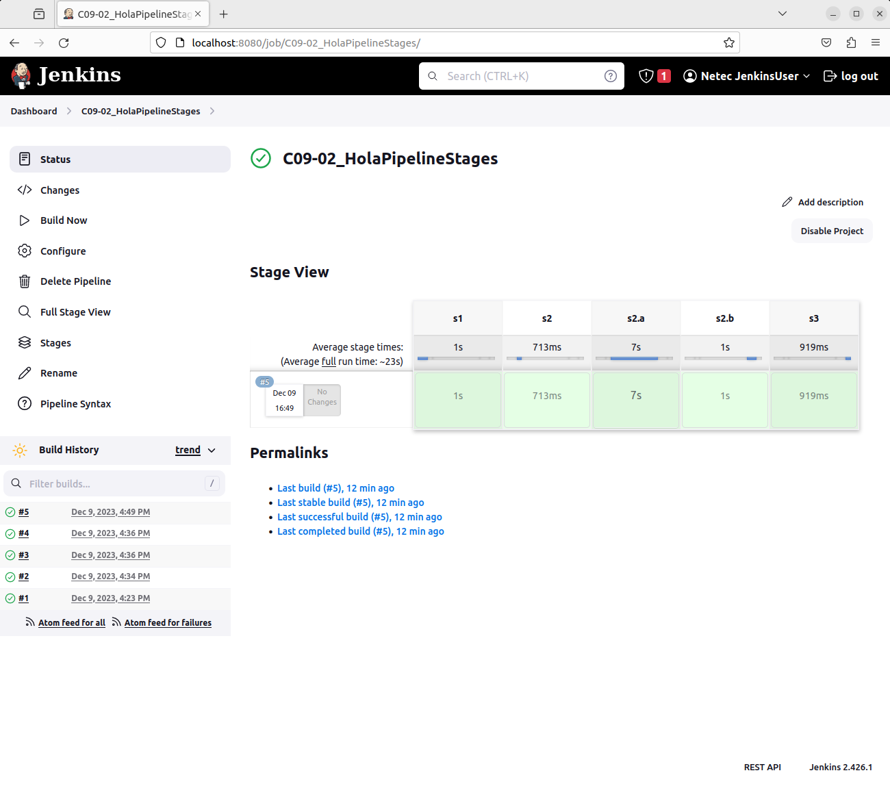
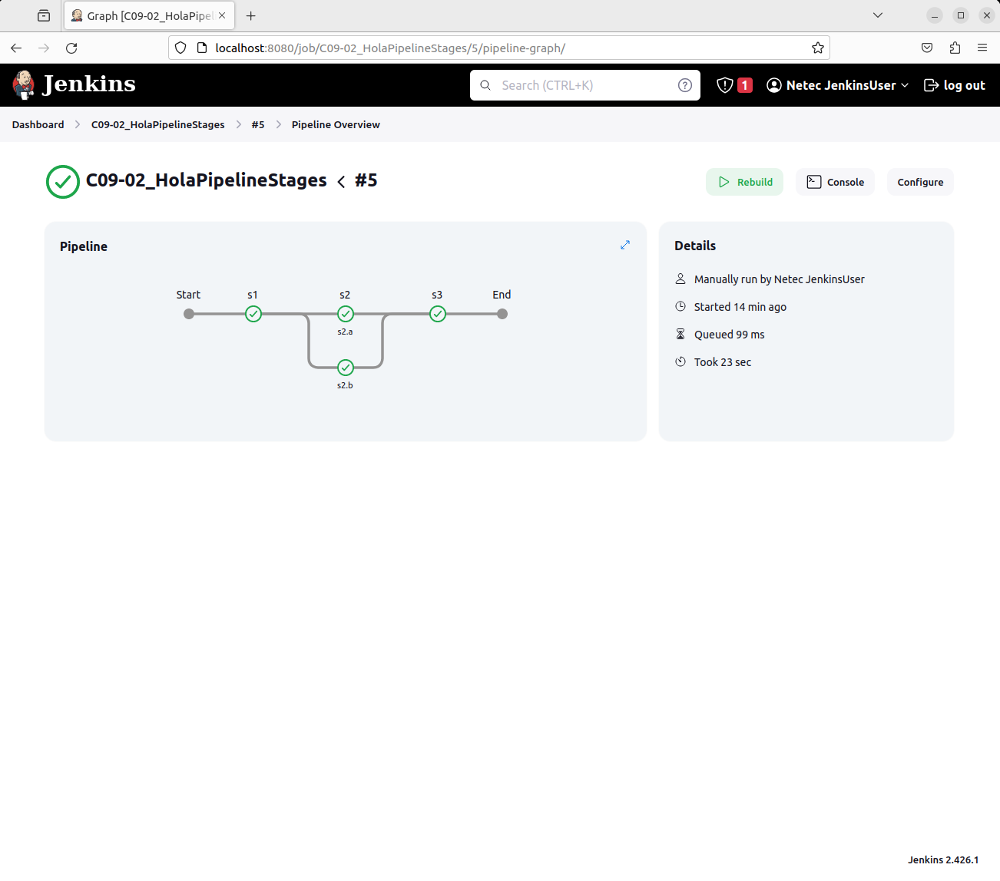

# HOLA STAGES

Tiempo aproximado: 10 minutos

## OBJETIVO

Crear un proyecto *pipeline* con un mensaje de texto en la línea de comandos.

## DESARROLLO

### COMPLEMENTO

En un navegador web ingresa el enlace <http://localhost:8080/manage/pluginManager/available> para configurar el complemento en *Jenkins*.

En el campo de búsqueda ingresa `Pipeline Graph View`, de la lista selecciona el componente localizado.

Marca la opción de `Install` y da clic en el botón `Install`.

Marca la opción `Restart Jenkins when installation is complete and no jobs are running` y espera a que el proceso termine la instalación y reinicie *Jenkins*.

### CREACIÓN

En la pantalla principal (<http://localhost:8080/>) de Jenkins crea un nuevo proyecto dando clic en [+ New Item](http://localhost:8080/view/all/newJob) con los siguientes datos:

- Nombre: `C09-02_HolaPipelineStages`
- Tipo de proyecto: `Pipeline`

Después de ingresar la información da clic en `OK`.

### CONFIGURACIÓN

A continuación, se indica la información a añadir en cada sección.

#### GENERAL

En la sección de `Configuration/General` ingresa la siguiente información:

- Descripción: `Prueba de concepto de proyecto pipeline con varias etapas secuenciales y en paralelo.`

#### PIPELINE

En la opción `Configuration/Pipeline` ingresa la siguiente información:

- Pipeline

  - Definition: Pipeline script

    - Script:

``` groovy
pipeline {
    agent any
    stages {
        stage('s1') {
            steps {
                sh 'echo "Stage 1"'
                // Construir la aplicación
            }
        }
        stage('s2') {
            parallel {
                stage('s2.a') {
                    steps {
                        sh 'sleep 5s'
                        sh 'echo "Stage A"'
                        // Pruebas unitarias
                    }
                }
                stage('s2.b') {
                    steps {
                        sh 'echo "Stage B"'
                        // Pruebas de integración
                    }
                }
            }
        }
        stage('s3') {
            steps {
                sh 'echo "Stage 3"'
                // Despliegue
            }
        }
    }
}
```

#### SAVE

Da clic en el botón de guardado ( `Save` )

### CONSTRUCCIÓN

Para comprobar el envío de las notificaciones ejecuta el *job* dando clic en la opción `Build Now` del menú lateral.

Adicionalmente comprueba los cambios en la interfaz del *job* y del *build*.



#### SALIDA EN CONSOLA

En la parte inferior de la barra lateral izquierda, en la sección `Build History` se puede apreciar el historial de ejecución (*build*) del *job*.

Al dar clic en alguno de los enlaces (en cada renglón) se puede observar la información general del *build*.

Para observar la salida en consola de la construcción se debe seleccionar la opción `Console Output` del menú lateral.

La salida debe ser semejante a:

``` shell
Lanzada por el usuario Netec JenkinsUser
[Pipeline] Start of Pipeline
[Pipeline] node
Running on Jenkins  in /var/lib/jenkins/workspace/C09-02_HolaPipelineStages
[Pipeline] {
[Pipeline] stage
[Pipeline] { (s1)
[Pipeline] sh
+ echo Stage 1
Stage 1
[Pipeline] }
[Pipeline] // stage
[Pipeline] stage
[Pipeline] { (s2)
[Pipeline] parallel
[Pipeline] { (Branch: s2.a)
[Pipeline] { (Branch: s2.b)
[Pipeline] stage
[Pipeline] { (s2.a)
[Pipeline] stage
[Pipeline] { (s2.b)
[Pipeline] sh
[Pipeline] sh
+ sleep 5s
+ echo Stage B
Stage B
[Pipeline] }
[Pipeline] // stage
[Pipeline] }
[Pipeline] sh
+ echo Stage A
Stage A
[Pipeline] }
[Pipeline] // stage
[Pipeline] }
[Pipeline] // parallel
[Pipeline] }
[Pipeline] // stage
[Pipeline] stage
[Pipeline] { (s3)
[Pipeline] sh
+ echo Stage 3
Stage 3
[Pipeline] }
[Pipeline] // stage
[Pipeline] }
[Pipeline] // node
[Pipeline] End of Pipeline
Finished: SUCCESS
```

### GRAFO DEL PIPELINE

En la pantalla de `status` de la construcción utiliza la opción `Pipeline Overview`.



## RESULTADO

Comenta los puntos más relevantes de esta sección.

---

[CAPÍTULO 09](../C09.md)
