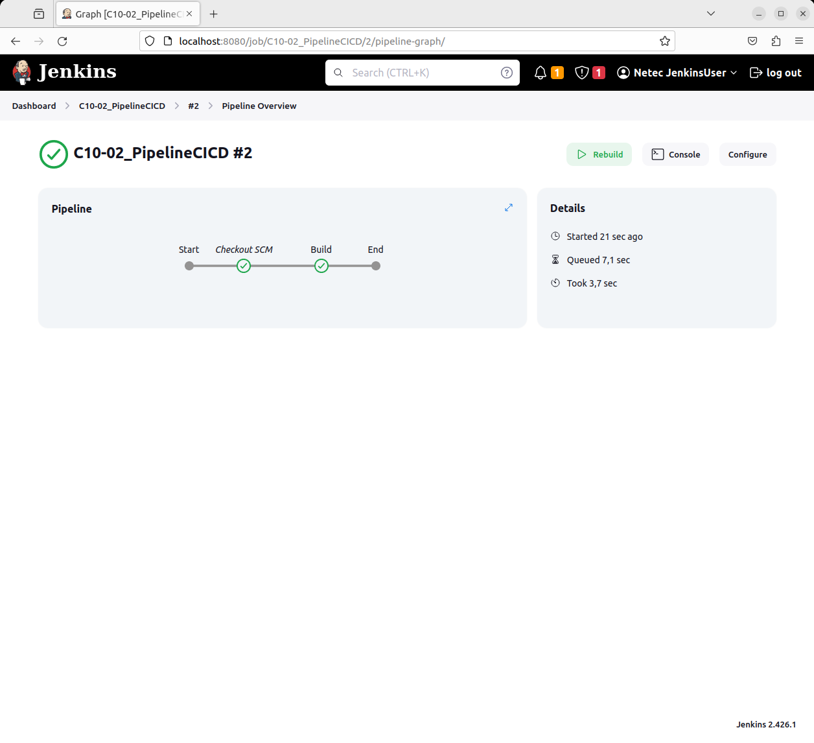

# PIPELINE CI/CD

Tiempo aproximado: 10 minutos

## OBJETIVO

Crear un proyecto _pipeline_ a partir de un _Jenkinsfile_ para un flujo de CI/CD.

## PRERREQUISITOS

Se requiere que el contenedor con _SonarQube_ este activo. Para iniciarlo ejecuta:

``` shell
docker container start sonarqube
```

## DESARROLLO

### RAMA DE TRABAJO

En la carpeta del repositorio de trabajo ubícate en la rama: `labs/jenkins-cicd`.

``` shell
git switch labs/jenkins-cicd
```

La salida debe ser similar a:

``` shell
Switched to branch 'labs/jenkins-cicd'
Your branch is up to date with 'origin/labs/jenkins-cicd'.
```

Ahora crea la rama en la que se harán las modificaciones de esta actividad:

``` shell
git checkout -b labs/jenkins-cicd_NOMBREUSUARIO
```

Recuerda que en "NOMBREUSUARIO" debes ingresar el tuyo.

La salida debe ser similar a:

``` shell
Switched to branch 'labs/jenkins-cicd_NOMBREUSUARIO'
Your branch is up to date with 'origin/labs/jenkins-cicd_NOMBREUSUARIO'.
```

### JENKINSFILE

En la carpeta raíz del proyecto crea el archivo llamado `Jenkinsfile` con el contenido mostrado a continuación:

``` jenkinsfile
pipeline {
    agent any
    triggers {
        githubPush()
    }
    stages {
        stage('Build') {
            steps {
                echo 'Stage para la construcción'
            }
        }
    }
}
```

### PUSH

Para guardar y subir los cambios realice los siguientes comandos:

``` shell
git add --all
git commit --message="Archivo Jenkinsfile inicial"
git push --set-upstream origin labs/jenkins-cicd_cabrera-pedro
```

Recuerde estos tres comandos, ya que cada cambio que se realice al `Jenkinsfile` deberá ser confirmado y subido para observar como se van adicionando etapas a la tubería.

### CREACIÓN

En la pantalla principal (<http://localhost:8080/>) de Jenkins crea un nuevo proyecto dando clic en [+ New Item](http://localhost:8080/view/all/newJob) con los siguientes datos:

- Nombre: `C10-02_PipelineCICD`
- Tipo de proyecto: `Pipeline`

Después de ingresar la información da clic en `OK`.

### CONFIGURACIÓN

A continuación, se indica la información a añadir en cada sección.

#### GENERAL

En la sección de `Configuration/General` ingresa la siguiente información:

- Descripción: `Flujo CI/CD para una aplicación Java con Maven.`

#### PIPELINE

En la opción `Configuration/Pipeline` ingresa la siguiente información:

- Pipeline
  - Definition: `Pipeline script from SCM`
    - SCM: `Git`
      - Repositories
        - Repository URL: `https://github.com/cabrera-pedro/jenkins_cabrera-pedro.git`
          - Recuerda que debe ser la URL a tu repositorio. La indicada es de ejemplo y la tuya debe ser similar ésta.
        - Credentials: `GitHub Course Credentials`
        - Branches to build
          - Branch Specifier (blank for 'any'): `labs/jenkins-cicd_cabrera-pedro`
            - Recuerda que debe ser la rama de tu repositorio. La indicada es de ejemplo y la tuya debe ser similar ésta.
    - Script Path: `Jenkinsfile`

#### SAVE

Da clic en el botón de guardado ( `Save` )

### CONSTRUCCIÓN

Para comprobar el envío de las notificaciones ejecuta el _job_ dando clic en la opción `Build Now` del menú lateral.

Adicionalmente comprueba los cambios en la interfaz del _job_ y del _build_.

#### SALIDA EN CONSOLA

En la parte inferior de la barra lateral izquierda, en la sección `Build History` se puede apreciar el historial de ejecución (_build_) del _job_.

Al dar clic en alguno de los enlaces (en cada renglón) se puede observar la información general del _build_.

Para observar la salida en consola de la construcción se debe seleccionar la opción `Console Output` del menú lateral.

La salida debe ser semejante a:

``` shell
Started by GitHub push by cabrera-pedro
Lightweight checkout support not available, falling back to full checkout.
Checking out git https://github.com/cabrera-pedro/jenkins_cabrera-pedro.git into /var/lib/jenkins/workspace/C10-02_PipelineCICD@script/81d02767bfa2c07a1ffa4a3d7c636ff5b7e94c5318d5a120bf140fd34eedee0e to read Jenkinsfile
The recommended git tool is: NONE
using credential githubCourseCredential
 > git rev-parse --resolve-git-dir /var/lib/jenkins/workspace/C10-02_PipelineCICD@script/81d02767bfa2c07a1ffa4a3d7c636ff5b7e94c5318d5a120bf140fd34eedee0e/.git # timeout=10
Fetching changes from the remote Git repository
 > git config remote.origin.url https://github.com/cabrera-pedro/jenkins_cabrera-pedro.git # timeout=10
Fetching upstream changes from https://github.com/cabrera-pedro/jenkins_cabrera-pedro.git
 > git --version # timeout=10
 > git --version # 'git version 2.34.1'
using GIT_ASKPASS to set credentials GitHub Course Credentials
 > git fetch --tags --force --progress -- https://github.com/cabrera-pedro/jenkins_cabrera-pedro.git +refs/heads/*:refs/remotes/origin/* # timeout=10
 > git rev-parse refs/remotes/origin/labs/jenkins-cicd_cabrera-pedro^{commit} # timeout=10
 > git rev-parse labs/jenkins-cicd_cabrera-pedro^{commit} # timeout=10
Checking out Revision d41180b87c598faa41a192127be4b6ad652f9b61 (refs/remotes/origin/labs/jenkins-cicd_cabrera-pedro)
 > git config core.sparsecheckout # timeout=10
 > git checkout -f d41180b87c598faa41a192127be4b6ad652f9b61 # timeout=10
Commit message: "Archivo Jenkinsfile inicial"
 > git rev-list --no-walk 6271779f04b1725a96249569a5e4c366ad6da6c5 # timeout=10
[Pipeline] Start of Pipeline
[Pipeline] node
Running on Jenkins  in /var/lib/jenkins/workspace/C10-02_PipelineCICD
[Pipeline] {
[Pipeline] stage
[Pipeline] { (Declarative: Checkout SCM)
[Pipeline] checkout
The recommended git tool is: NONE
using credential githubCourseCredential
 > git rev-parse --resolve-git-dir /var/lib/jenkins/workspace/C10-02_PipelineCICD/.git # timeout=10
Fetching changes from the remote Git repository
 > git config remote.origin.url https://github.com/cabrera-pedro/jenkins_cabrera-pedro.git # timeout=10
Fetching upstream changes from https://github.com/cabrera-pedro/jenkins_cabrera-pedro.git
 > git --version # timeout=10
 > git --version # 'git version 2.34.1'
using GIT_ASKPASS to set credentials GitHub Course Credentials
 > git fetch --tags --force --progress -- https://github.com/cabrera-pedro/jenkins_cabrera-pedro.git +refs/heads/*:refs/remotes/origin/* # timeout=10
 > git rev-parse refs/remotes/origin/labs/jenkins-cicd_cabrera-pedro^{commit} # timeout=10
 > git rev-parse labs/jenkins-cicd_cabrera-pedro^{commit} # timeout=10
Checking out Revision d41180b87c598faa41a192127be4b6ad652f9b61 (refs/remotes/origin/labs/jenkins-cicd_cabrera-pedro)
 > git config core.sparsecheckout # timeout=10
 > git checkout -f d41180b87c598faa41a192127be4b6ad652f9b61 # timeout=10
Commit message: "Archivo Jenkinsfile inicial"
[Pipeline] }
[Pipeline] // stage
[Pipeline] withEnv
[Pipeline] {
[Pipeline] stage
[Pipeline] { (Build)
[Pipeline] echo
Stage para la construcción
[Pipeline] }
[Pipeline] // stage
[Pipeline] }
[Pipeline] // withEnv
[Pipeline] }
[Pipeline] // node
[Pipeline] End of Pipeline
Finished: SUCCESS
```

### GRAFO DEL PIPELINE

En la pantalla de `status` de la construcción utiliza la opción `Pipeline Overview`.



## RESULTADO

Comenta los puntos más relevantes de esta sección.

---

[CAPÍTULO 10](../C10.md)
